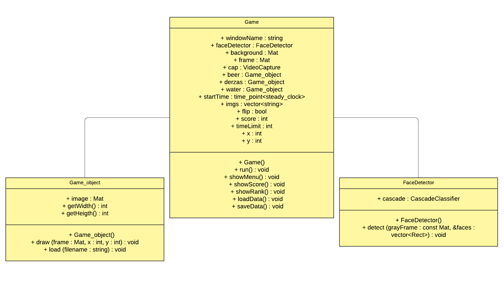

# 🎮 Projeto OPENCV - Derzas Adventures'

# 🕹️ Equipe

- 🎧 [Alexandre Guedes](https://github.com/AlexandrxMK)
- ⚔️ [Arthur Maximus](https://github.com/Maximusthr)
- 💻 [Eliabe Rodrigues](https://github.com/EliabeRP)

# 👾 Sobre o Projeto

Projeto desenvolvido para a disciplina de Linguagem de Programação I (LP I).
O mesmo consiste na criação de um jogo utilizando o <b>OPENCV</b>, composto de requisitos e especificações que atendam o projeto, tais como:
1. Diagrama de Classes
2. Possuir métodos
3. Rodar indefinidamente
4. Utilizar o OpenCV

# 🏆 Objetivo e Funcionalidades

O objetivo do jogo consiste em pegar a maior quantidade de bebidas no menor tempo possível, evitando a água, além disso algumas funcionalidades que o jogo possui são:
1. Menu interativo
2. Ranking de pontuações
3. Pontuação na tela
4. Bebidas aleatórias em posições aleatórias na tela
5. Água é uma bebida "perseguidora", a qual você deve evitar
6. Sons diversos ao pegar uma bebida
7. Tempo de jogo ajustável, dentro do código, por padrão 1 minuto

# 📌 Instalação

Instalando o <b>Derzas Adventures'</b>:
> Lembrando que para continuar a instalação, é necessário que você possua a biblioteca do OpenCV no seu sistema operacional.

1. Clone o repositório (ou faça a instalação do arquivo ZIP):
  ```sh
  git clone https://github.com/Maximusthr/opencv-face-detection-game-c-.git
  ```
2. É preciso instalar a biblioteca de áudio <b>mpg123</b> para que os sons do jogo sejam tocados:
> Comando de instalação apenas para o Ubuntu/Debian:
  ```sh
  sudo apt-get install mpg123
  ```
3. Comando de compilação:
  ```sh
  /compile.sh
  ```

Caso você não queira utilizar o compile.sh:
  ```sh
  g++ main.cpp src/*.cpp `pkg-config --cflags opencv4` `pkg-config --libs --static opencv4` -o main
  ./main
  ```

# 💎 Diagrama de Classes


